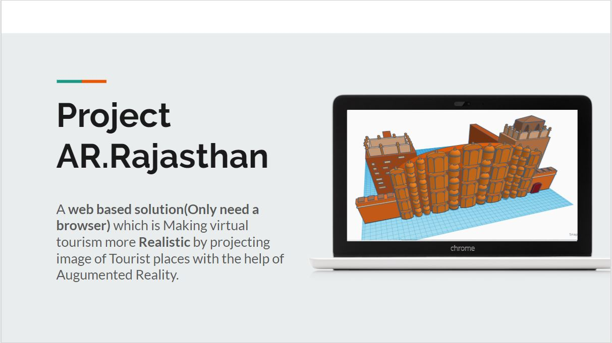
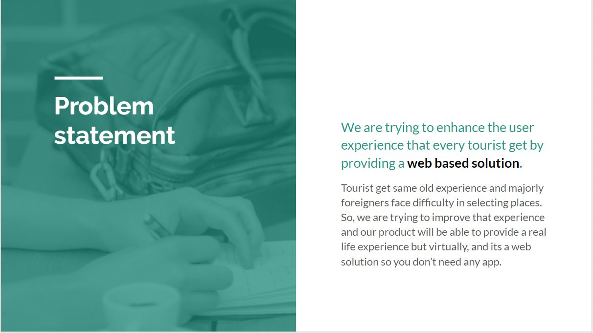
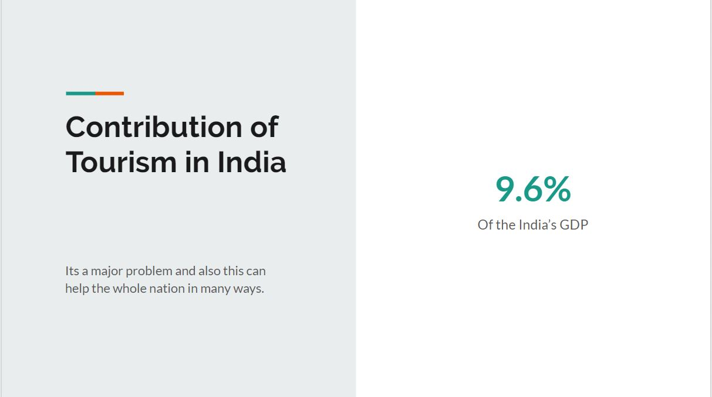
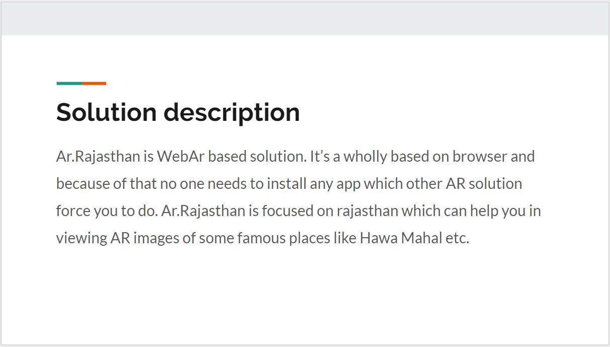
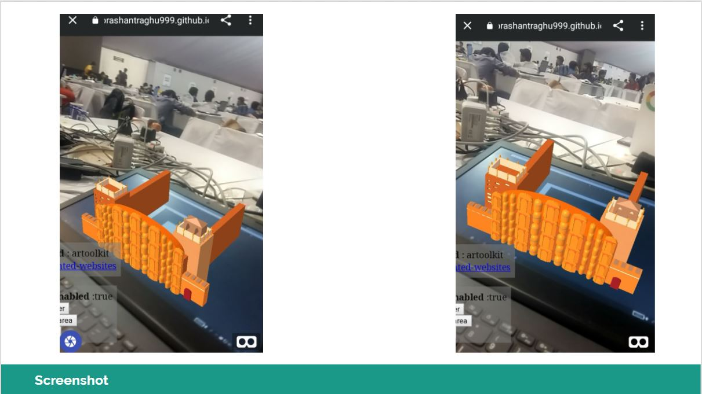

# Augment hawa
## Team Members
[insaneNaman](https://github.com/insanenaman)
[prashant-raghu](https://github.com/prashant-raghu)
# AR Rajasthan  
A web based solution(only need is a browser) which is making virtual tourism more Realistic by projecting image of tourist places with the help of Augmented Reality.
People currently have different apps which suggest them different tourist places but still they get same experience across all apps i.e,a simple image.

# Presentation Link
https://docs.google.com/presentation/d/1feEDd053jwL74JrYckwXCeDrS4LnLBeneXpqj92gNTA/edit?usp=sharing
# Video Link
https://drive.google.com/drive/folders/19iYKwxPxUJNYr5G1lDqisT-ruAmjEOzo?usp=sharing
